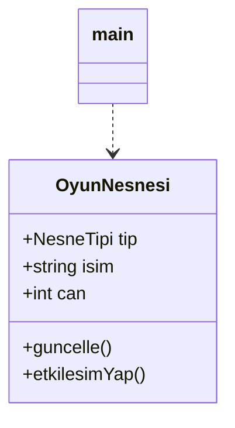
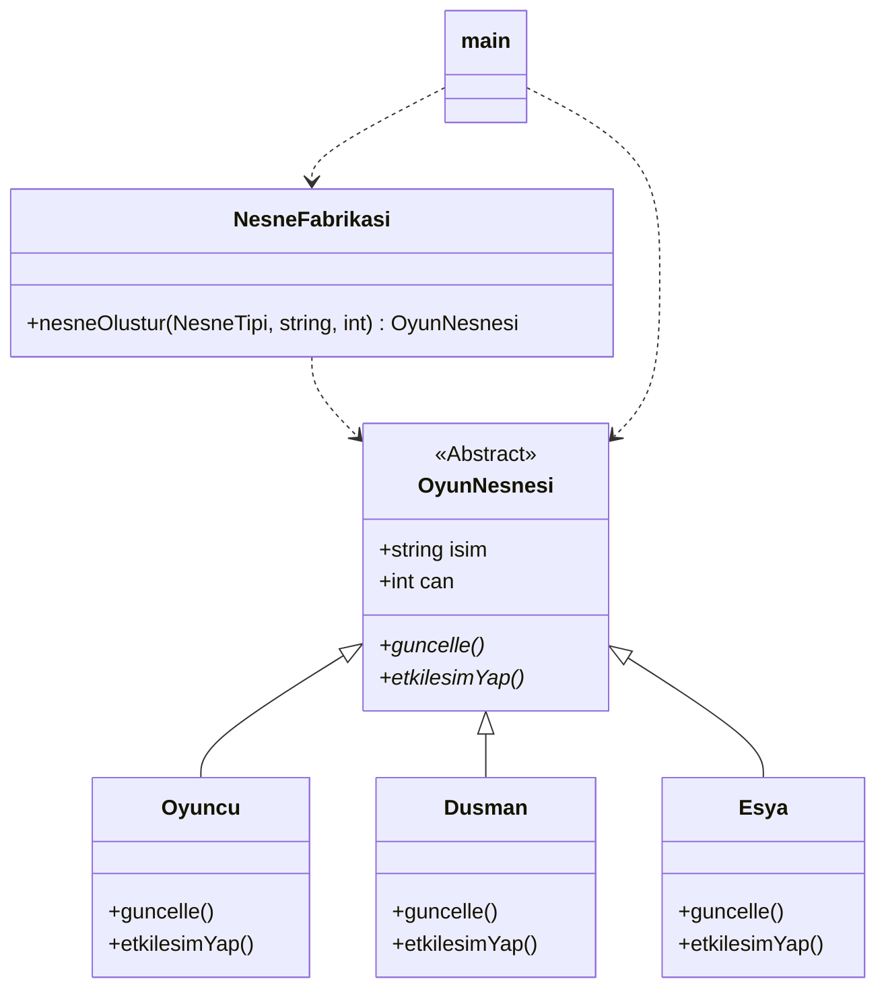
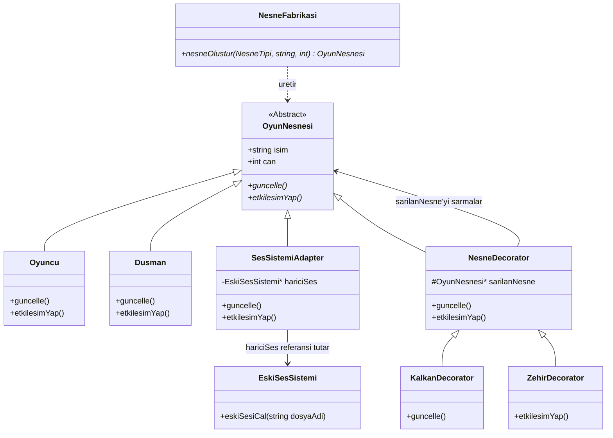

# PATTERNS.md - Faz 1

## Uygulanan Örüntü: Factory Method (Fabrika Metodu)

### 1. Nerede Kullanıldı?
Projedeki oyuncu, düşman ve eşya gibi nesnelerin oluşturulduğu kısımda kullandım. Eskiden bunları main.cpp içinde tek tek el yazısıyla new diyerek üretiyordum. Şimdi ise hepsini NesneFabrikasi diye tek bir sınıfın içine topladım ve üretimi oradan yapıyorum.

### 2. Neden Seçildi?
if-else Yapılarından Kurtulmak İçin: Eski kodda main fonksiyonu hangi nesnenin nasıl kurulacağını, içine ne parametre alacağını tek tek bilmek zorundaydı. Bu da kodları birbirine çok bağlıyordu. Fabrika kullanarak main'i bu dertten kurtardım.

Yeni Karakter Ekleme Kolaylığı (Open/Closed): Oyuna ileride yeni bir nesne tipi (mesela Tuzak veya NPC) eklemek istediğimde, gidip main içindeki çalışan oyun döngüsünü bozmak istemiyorum. Yeni bir tip geldiğinde mevcut koda dokunmadan, sadece yeni bir sınıf açıp sisteme ekleyebilmek için bu örüntüyü seçtim.

### 3. Ne Kazandırdı?
Kodlar Birbirine Karışmıyor (Tek Sorumluluk): Nesnelerin oyun içindeki görevleri ile onların ilk başta nasıl üretileceği işini birbirinden ayırdım. Üretim işi artık tek bir merkezden dönüyor.

Main Fonksiyonu Sadeleşti: main fonksiyonu artık arka planda nesnelerin nasıl yaratıldığıyla, hangi constructor'ı çağırdığıyla ilgilenmiyor. Sadece fabrikaya "bana bir düşman ver" diyor ve işine bakıyor.

Daha Temiz Kod: Kodun okunması çok daha kolaylaştı. Yarın bir gün nesnelerin can değerlerini veya parametrelerini değiştirmek istersem, projenin her yerini değil sadece fabrika sınıfının içini

## faz-0 

## faz-1

## ATTERNS.md - Faz 2 (Structural Patterns)
Faz 1'de nesne üretim işini fabrikaya devretmiştik. Bu fazda ise kodun mevcut işleyişini hiç bozmadan oyuna dış kütüphane entegre etmek ve nesnelere dinamik özellikler kazandırmak için iki adet yapısal tasarım örüntüsü uyguladım.

## 1. Uygulanan Örüntü: Adapter (Adaptör)
A. Nerede Kullanıldı?
Oyuna dışarıdan dahil ettiğimiz, bizim kod yapımıza ve OyunNesnesi sınıfımıza hiç uymayan eski bir ses kütüphanesini (EskiSesSistemi) projeye bağlarken kullandım. SesSistemiAdapter adında bir sınıf oluşturarak bu uyumsuz yapıyı sistemimize entegre ettim.

B. Neden Seçildi?
Mevcut Kodu Korumak İçin: Dışarıdan hazır aldığımız ses kütüphanesinin kaynak kodlarını değiştirme şansımız yoktu. Bizim oyun döngümüz ise sadece OyunNesnesi tipindeki sınıfları çalıştırabiliyordu. Araya bir adaptör koyarak, eski ses sınıfını sanki bizim normal bir oyun nesnemizmiş gibi sisteme tanıttım.

Açık/Kapalı Prensibi: Ses sistemini eklemek için ne main içindeki oyun döngüsünü ne de diğer karakter sınıflarını değiştirmek zorunda kalmadım.

C. Ne Kazandırdı?
Uyumsuz Yapılar Beraber Çalıştı: Bizim sistemimiz etkilesimYap() metodunu çağırdığında, adaptör bunu arka planda otomatik olarak dış kütüphanenin eskiSesiCal() metoduna çevirdi.

Esneklik: İleride bu ses kütüphanesini çöpe atıp modern başka bir kütüphane getirsek bile main koduna hiç dokunmadan sadece adaptörün içini değiştirerek sistemi kurtarabileceğiz.

## 2. Uygulanan Örüntü: Decorator (Süsleyici)
A. Nerede Kullanıldı?
Oyundaki karakterlere (Oyuncu ve Dusman) çalışma zamanında (runtime) dinamik olarak kalkan veya zehir hasarı gibi ekstra özellikler/efektler eklemek için kullandım.

B. Neden Seçildi?
Sınıf Patlamasını Önlemek İçin: Eğer bu örüntüyü kullanmasaydım; kalkanlı oyuncu için ayrı sınıf, zehirli oyuncu için ayrı sınıf, hem kalkanlı hem zehirli oyuncu için apayrı alt sınıflar türetmek zorunda kalacaktım (KalkanliOyuncu, ZehirliKalkanliDusman vb.). Bu da projeyi çorba yapacaktı.

Dinamik Modifikasyon: Karakterlerin koduna dokunmadan, onları koruyucu bir katmanla sarmalayarak (wrap ederek) istendiğinde özellik ekleyip istendiğinde çıkarmayı sağladım.

C. Ne Kazandırdı?
Esnek Genişleme: Mevcut Oyuncu sınıfının içindeki hareket ve envanter koduna hiç dokunmadan, dışarıdan ona KalkanDecorator giydirerek canını arttırdım ve ekrana kalkan efekti yazdırdım.

Kod Tekrarı Azaldı: Aynı kalkan veya zehir efektini hem oyuncuya hem de düşmana tek bir süsleyici sınıf üzerinden uygulayabildim.

##  Faz 2 - Mimari UML Diyagramı Güncellemesi
GitHub'ın .md dosyasında temizce çizebilmesi için senin Faz 1'deki sade ve çalışan formatına göre tasarladığım güncel UML diyagramı:

