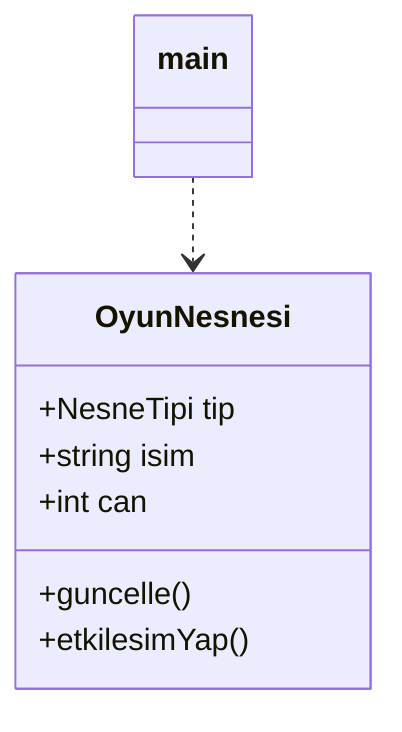
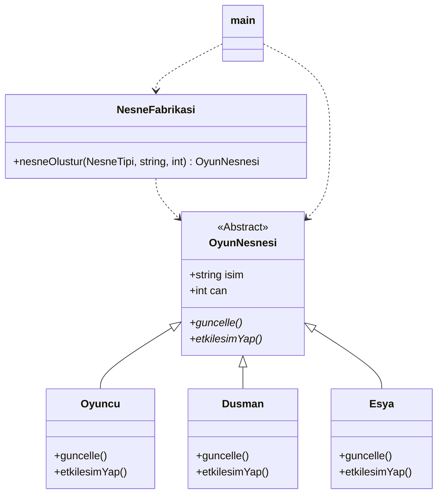
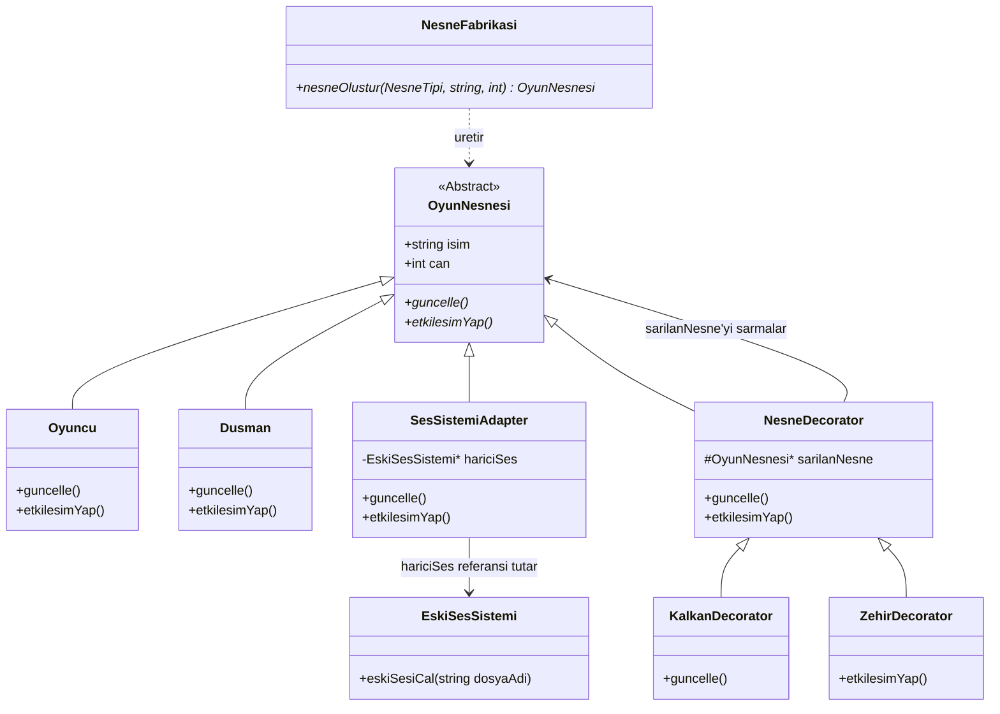

## faz-0 

```mermaid
classDiagram
    class OyunNesnesi {
        +NesneTipi tip
        +string isim
        +int can
        +guncelle()
        +etkilesimYap()
    }
    class main {
    }

    main ..> OyunNesnesi
```
## faz-1

```mermaid
classDiagram
    class OyunNesnesi {
        <<Abstract>>
        +string isim
        +int can
        +guncelle()*
        +etkilesimYap()*
    }
    class Oyuncu {
        +guncelle()
        +etkilesimYap()
    }
    class Dusman {
        +guncelle()
        +etkilesimYap()
    }
    class Esya {
        +guncelle()
        +etkilesimYap()
    }
    class NesneFabrikasi {
        +nesneOlustur(NesneTipi, string, int) OyunNesnesi
    }
    class main {
    }

    OyunNesnesi <|-- Oyuncu
    OyunNesnesi <|-- Dusman
    OyunNesnesi <|-- Esya
    NesneFabrikasi ..> OyunNesnesi
    main ..> NesneFabrikasi
    main ..> OyunNesnesi
```
## faz2

```mermaid
classDiagram
    class OyunNesnesi {
        <<Abstract>>
        +string isim
        +int can
        +guncelle()*
        +etkilesimYap()*
    }

    class Oyuncu {
        +guncelle()
        +etkilesimYap()
    }

    class Dusman {
        +guncelle()
        +etkilesimYap()
    }

    %% ---- ADAPTER PATTERN ----
    class EskiSesSistemi {
        +eskiSesiCal(string dosyaAdi)
    }

    class SesSistemiAdapter {
        -EskiSesSistemi* hariciSes
        +guncelle()
        +etkilesimYap()
    }

    %% ---- DECORATOR PATTERN ----
    class NesneDecorator {
        #OyunNesnesi* sarilanNesne
        +guncelle()
        +etkilesimYap()
    }

    class KalkanDecorator {
        +guncelle()
    }

    class ZehirDecorator {
        +etkilesimYap()
    }

    class NesneFabrikasi {
        +nesneOlustur(NesneTipi, string, int) OyunNesnesi*
    }

    OyunNesnesi <|-- Oyuncu
    OyunNesnesi <|-- Dusman
    OyunNesnesi <|-- SesSistemiAdapter
    OyunNesnesi <|-- NesneDecorator

    SesSistemiAdapter --> EskiSesSistemi : hariciSes referansi tutar

    NesneDecorator <|-- KalkanDecorator
    NesneDecorator <|-- ZehirDecorator
    NesneDecorator --> OyunNesnesi : sarilanNesne'yi sarmalar

    NesneFabrikasi ..> OyunNesnesi : uretir
```
